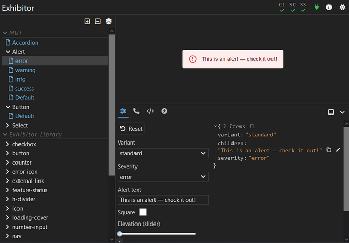

<p align="center">
  <picture>
    <source media="(prefers-color-scheme: dark)" srcset="./img/wordmark-dark.png">
    <source media="(prefers-color-scheme: light)" srcset="./img/wordmark-light.png">
    
  </picture>
</p>

<p align="center">
  <em>Snappy and delightful React component workshop</em>
</p>

<p align="center">
  <a href="https://github.com/samhuk/exhibitor/actions/workflows/build.yaml/badge.svg" target="_blank">
    
  </a>
  <a href="https://img.shields.io/badge/License-MIT-green.svg" target="_blank">
    
  </a>
  <a href="https://badge.fury.io/js/exhibitor.svg" target="_blank">
    
  </a>
</p>

<div align="center">
  
</div>

## Overview

Exhibitor is a React component workshop - a tool for creating React component libraries. It allows you to see your individual React UI components in a hot-reloading website whilst you create them.

## Usage Overview

Exhibitor is simple to setup. It can be added to an existing React codebase that contains components or be used to bootstrap one from scratch. See the [Exhibitor Wiki](https://github.com/samhuk/exhibitor/wiki) for more information.

If you already have React components, using Exhibitor is as easy as this:

```
npm install --save-dev exhibitor react react-dom
```

Create exhibitions of your components:

```typescript
// src/button.exh.ts (or .js, .jsx, .tsx, ...)
import exhibit from 'exhibitor'
import Button from './button' // I.e. button.tsx

exhibit(Button, 'Button')
  // Define any default props
  .defaults({
    color: 'default',
  })
  // Define which props are events of the component
  .events({ onClick: true })
  // Define miscellaneous options
  .options({ group: 'Final Review' })
  // Define variants with different prop values
  .variant('Green', defaultProps => ({
    ...defaultProps,
    color: 'green',
  }))
  // Group variants together
  .group('Large', ex => ex
    .defaults(p => {
      ...p,
      size: 'large'
    })
    .variant('Green', p => {
      ...p,
      color: 'green'
    }))
  .build()
```

Start exhibitor:

```
npx exhibitor start
```

## Major Features

* Extremely fast
* Simple
* Sane defaults
* Delightful Javascript API with Typescript-centric design for zero guesswork.
* esbuild
* Gives you the choice of React version to use
* Accessibility testing
* Playwright end-to-end testing integration

## Development

Want to join in and contibute to Exhibitor? Awesome! See [./contributing/development.md](./contributing/development.md).

---

If you would like to support my work, feel free to [sponsor me on GitHub](https://github.com/sponsors/samhuk) or [buy me a coffee](https://www.buymeacoffee.com/samhuk) ✨
