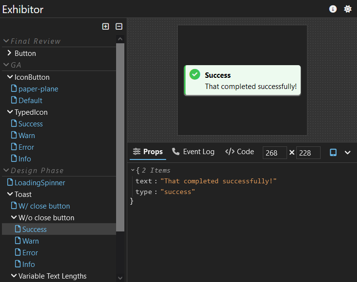

<h1 align="center">exhibitor</h1>
<p align="center">
  <em>Snappy and delightful React component workshop</em>
</p>

<p align="center">
  <a href="https://img.shields.io/badge/License-MIT-green.svg" target="_blank">
    
  </a>
</p>

<div align="center">
  
</div>

## Overview

Exhibitor is an extremely snappy and delightful React component workshop.

## Usage Overview

Exhibitor can be added to an existing React codebase that contains components, or be used to bootstrap one from scratch. Ensure you have [Node.js version >14.x](https://nodejs.org/en/) installed (latest/current version will suffice).

**From scratch:**

In the parent directory that you want to create the component library in:

For MacOS and Linux (and WSL):

```bash
mkdir my-component-library &&\
  cd my-component-library &&\
  npm init -y &&\
  npm i -S exhibitor &&\
  npx exhibitor init
```

For Windows:

```batch
mkdir my-component-library && cd my-component-library && npm init -y && npm i -S exhibitor && npx exhibitor init
```

**Existing codebase:**

```
npm i -S exhibitor react react-dom
```

For a standard component, for example:

```tsx
// src/button.tsx
import React from 'react'
import './button.scss'
export const render = (props: { onClick: ..., color: ... }) => (
  <button>...</button>
)
export default render
```

Declare exhibitions of your components with the Exhibitor Javascript API:

```typescript
// src/button.exh.ts
import exhibit from 'exhibitor'
import Button from './button'

exhibit(Button, 'Button')
  // Define any default values for props
  .defaults({
    onClick: () => undefined,
    color: 'default',
    ...
  })
  // Define which props correspond to events of the component
  .events({
    onClick: true,
  })
  // Define miscellaneous options
  .options({ group: 'Final Review' })
  // Define variants with varying prop values
  .variant('Green', defaultProps => ({
    ...defaultProps,
    color: 'green',
  }))
  ...
  // Group variants together
  .group('Large', ex => ex
    .defaults(p => {
      ...p,
      size: 'large'
    })
    .variant('Green', p => {
      ...p,

    })
    ...
  ...
  .build()
```

Start exhibitor:

```
npx exhibitor start
```

Optionally define a configuration file for the Exhibitor CLI:

```jsonc
// exh.config.json
{
  "$schema": "https://raw.githubusercontent.com/samhuk/exhibitor/master/src/cli/config/schema.json", 
  "include": ["./src/**/*.exh.ts"],
  "watch": ["./src/**/*"],
  ...
}
```

## Major Features

* Extremely fast
* Simple
* Sane defaults
* Delightful Javascript API with Typescript-centric design for zero guesswork.
* esbuild
* Gives you the choice of React version to use
* e2e testing integration **[Planned]**

## Development

Want to join and contibute to Exhibitor? See [./contributing/development.md](./contributing/development.md).

---

If you would like to support my work, feel free to [buy me a coffee](https://www.buymeacoffee.com/samhuk) or sponsor me on GitHub ✨
